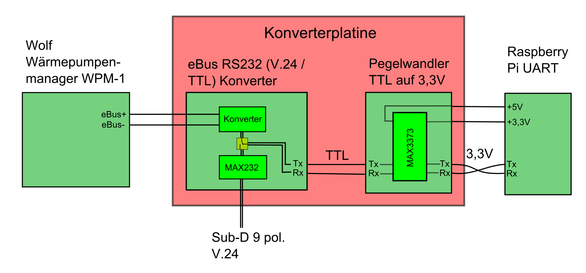
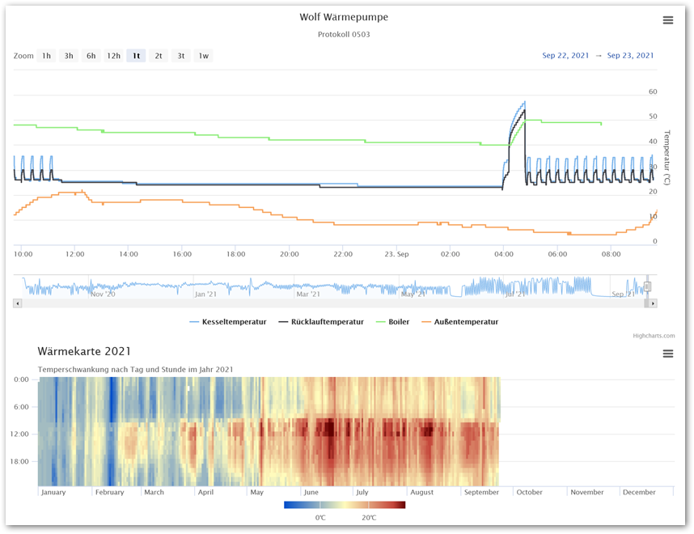
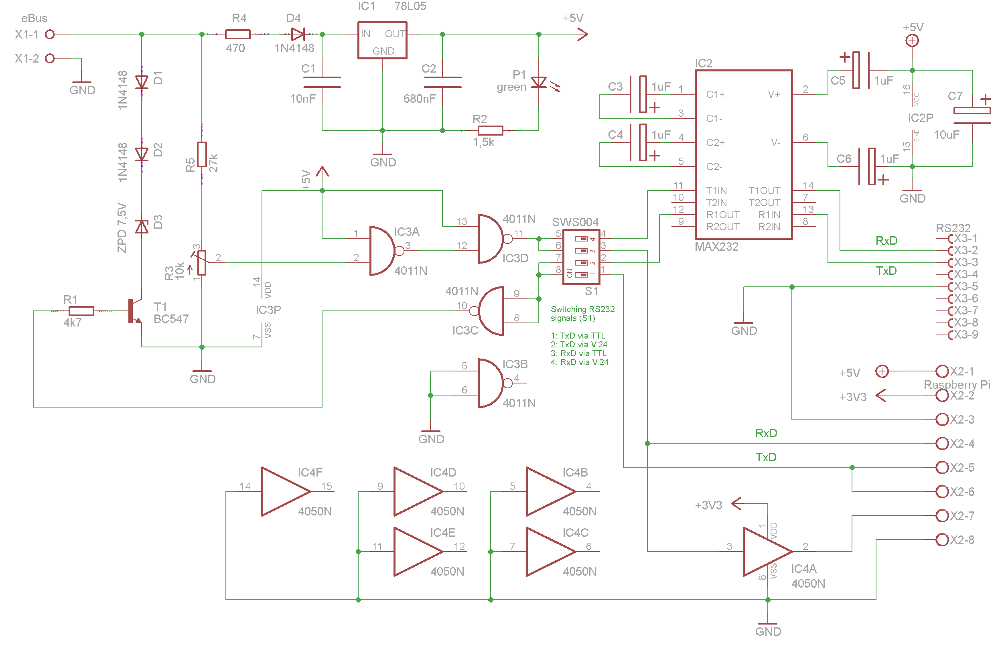
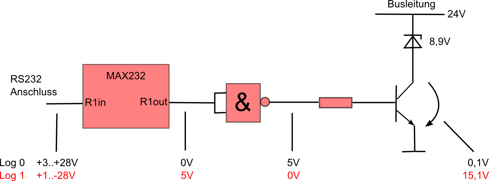
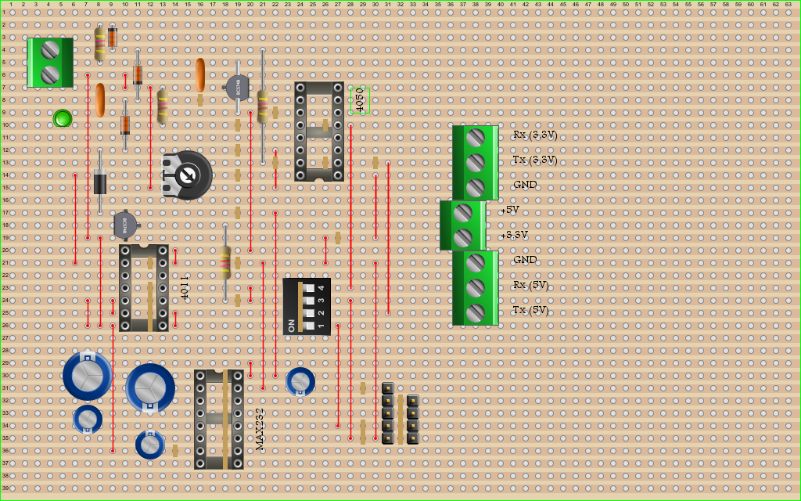
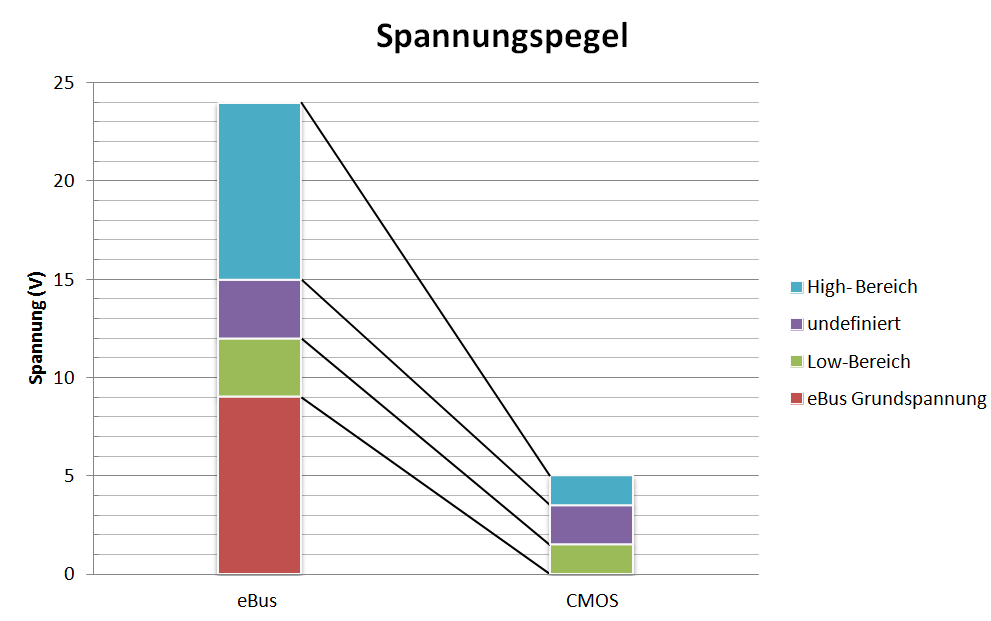
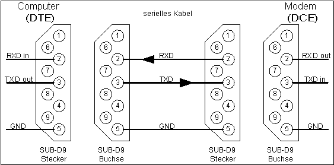

% Betriebsdatenerfassung Wolf Wärmepumpe
% Mark Buttig
% 07.11.2014

Vorhaben
========

Das Ziel dieses Projekts ist in erster Linie die Betriebsdatenerfassung einer
Wolf Wärmepumpe (BWS-1-06, Sole/Wasser) zu realisieren. Angezapft können diese
Daten vom Wärmepumpenmanager WPM-1 über die dort vorhandene eBus-Schnittstelle.

Aus den Daten können dann verschiedenartige Diagramme erstellt werden um die
Funktion der Wärmepumpe und deren Einstellungen überprüfen bzw. optimieren zu
können.

Als weiteres Ziel wäre dann eine Konfiguration der Anlage über z.B. eine
Web-Applikation zu ermöglichen.

Verwendete Werkzeuge
====================

* Dokumentation
    * Pandoc 1.13.0.1 (http://johnmacfarlane.net/pandoc
    * MiKTeX 2.9 (http://miktex.org)
* Schaltplanentwurf
    * Eagle 7.1.0 (http://www.cadsoft.de)
    * BlackBoard 1.1.0 (http://blackboard.serverpool.org)
* Versionsverwaltung
    * Subversion
    * TortoiseSVN

Fakten zum eBus
===============

* Verpolungssicherer Zweidraht-Bus
* Teilnehmer können über den Bus versorgt werden. Max Teilnehmerstrom 18mA
* Stromüberschuss im Bus max. 100mA.
* Leitungslänge >100m
* Kommunikation erfolgt Master -> Master; Master -> Slave
* Multimasterfähig mit max. 25 Master und 228 Slave, max Teilnehmerzahl 253
* Feste Übertragungsrate von 2400 Baud
* Low-Aktiver Bus mit
    * High (1) -> 15-24 VDC
    * Low (0) -> 9-12 VDC
* Serielle Datenübertragung mit 8-bit UART-Mode
* 254 Primärbefehle und 254 Sekundärbefehle -> 64516 Befehle
* Fehlerbehandlung durch 8-bit-CRC (Cyclic Redundancy Check)
* Kollisionsüberwachung auf dem Bus durch SYN-Zeichen in dem die Priorität des
  Masters festgelegt wird.
* Der Datenrahmen geht aus dem RS 232 Standart hervor.

Schaltung
=========

Der Wärmepumpenmanager WPM-1 besitzt eine eBus-Schnittstelle deren Pegel zur
weiteren Verwendung angepasst werden muss. Hierzu wird im ersten Stadium die
beiden eBus Leitungen im ersten Konverterblock auf ein TTL Pegel von 0 bis 5V
gebracht.

Um diesen ersten Block zu testen und evtl. schon mal Informationen auf dem eBus
sichtbar zu machen, wird dieses Signal durch den MAX232-Baustein auf RS232 V.24
Pegel gebracht. Damit ist es möglich, über einen PC eine RS232 Verbindung
aufzubauen und den Datenstrom mitzulesen.

Letzten Endes sollen aber die Daten von einem Raspberry Pi (RPi) eingelesen und
zur weiteren Verarbeitung der Daten gespeichert werden. Der RPi besitzt eine
UART Schnittstelle der mit einem max. Pegel von 3,3V arbeitet.

Somit muss wieder eine Pegelanpassung stattfinden vom TTL-Pegel auf die besagten
3,3V. Dies geschieht im nächsten Schritt mit dem Pegelwandler MAX3373. Dieses
Signal kann nun direkt auf die UART-Schnittstelle des RPi geführt werden.

Einstellung R3
==============

Die Pegel des eBus müssen zur Verarbeitung mittels des CMOS 4011 auf desen
logische Pegel angepasst werden.

1.  IC3 aus Sockel entnehmen
2.  12V zwischen eBus(+) und eBus(-) anlegen. Entspricht oberster Level vom
    Low-Pegel.
3.  R3 so einstellen, dass an Pin 2 max. 1,5V anliegen.
4.  15V zwischen eBus(+) und eBus(-) anlegen. Entspricht unterster Level vom
    High-Pegel.
5.  R3 so nachstellen, dass an Pin 2 min. 3,5V anliegen.
6.  Schritte 2 bis 5 wiederholen bis R3 für beide Pegel richtig eingestellt ist.

    Schnittstelle    Low-Pegel (V)  High-Pegel (V)
    ---------------  -------------  --------------
    eBus             9..12          15..24
    CMOS 4011 (TTL)  0..1,5         3,5..5

    Table: Pegel für eBus und TTL

7.  Schaltung spannungsfrei schalten.
8.  IC3 wieder in Sockel einbauen.

RS232 Kabelbelegung
===================

Der Anschluss an ein PC wird über ein normales (nicht Nullmodem-Kabel) 9 poliges
SUB-D 9 Kabel Buchse-Buchse (Belegung 1:1) bewerkstelligt.

\

Stücklisten
===========

 Pos.   Anzahl  Beschreibung                         Symbol           €/Stk.
-----  -------  -----------------------------------  --------------  -------
    1    1 Stk  4,7k Ohm Widerstand                  R1               0,10
    2    1 Stk  1,5k Ohm Widerstand                  R2               0,10
    3    1 Stk  470 Ohm Widerstand                   R4               0,10
    4    1 Stk  27k Ohm Widerstand                   R5               0,10
    5    1 Stk  10k Ohm Potentiometer                R3               0,50
    6    3 Stk  1N4148 Diode                         D1, D2, D4       0,15
    7    1 Stk  BZX85 Zehnerdiode 7,5V/1,3W          D3               0,30
    8    1 Stk  BC547B NPN Transistor                Q1               0,30
    9    1 Stk  78L05 Festspannungsregler 5V         IC1              0,60
   10    1 Stk  10nF Kondensator                     C1               0,40
   11    1 Stk  680nF Kondensator                    C2               0,40
   12    1 Stk  LED, 2mA/2V, 3mm, grün               D4               0,20
   13    1 Stk  CMOS 4011N                           IC3              0,68
   14    4 Stk  1uF Elektrolyt Kondensator           C3, C4, C5, C6   0,40
   15    1 Stk  10uF Elektrolyt Kondensator          C7               0,45
   16    1 Stk  MAX232                               IC2              1,50
   17    1 Stk  DIP Switch 2 pol.                    J1               0,90
   18    1 Stk  DIP Switch 4 pol.                    S1               1,00
   19    1 Stk  DIP Sockel 14 pol.                                    0,15
   20    1 Stk  DIP Sockel 16 pol.                                    0,15
   21    1 Stk  Sub-D 9 pol. Buchse                  X3               1,10
   22    1 Stk  Anschlussklemme 2 pol.               X1               0,30
   23    1 Stk  Anschlussklemme 3 pol.               X2               0,40
   24    1 Stk  MAX3373
   25    1 Stk  Streifenrasterplatine                                 3,00

Table: Stückliste eBus-Konverter

 Pos.   Anzahl  Beschreibung                         Händler   €/Stk.
-----  -------  -----------------------------------  -------  -------
    1   1 Stk.  Logilink USB 2.0 zu Seriell Adapter  Arlt        8,98

Table: Stückliste Hardwarekomponenten

Lebenslauf
==========

Änderungen am 11.11.2014
------------------------

* Entferne Brücke (5,20) (5,29)
* Entferne Brücke (9,5) (9,13)
* Entferne Brücke (7,2) (7,4)
* D4 einbauen (9,4) (9,2)
* S1 entfernen
* C1 austauschen 680nF -> 10nF
* D1 Verdrahtung ändern auf (11,8) (11,4)
* R4 einbauen (22,13) (22,4)
* C7 Verdrahtung ändern auf (24,31) (24,30)
* Brücke einbauen (20,30) (20,29)
* Brücke ändern auf (22,30) (22,17)
* Unterbrechung (19,17)
* Unterbrechung (27,19)
* Anschlussklemme 2 pol. (38,19) (38,17)
* Anschlussklemme 2 pol. (38,19) (38,17)
